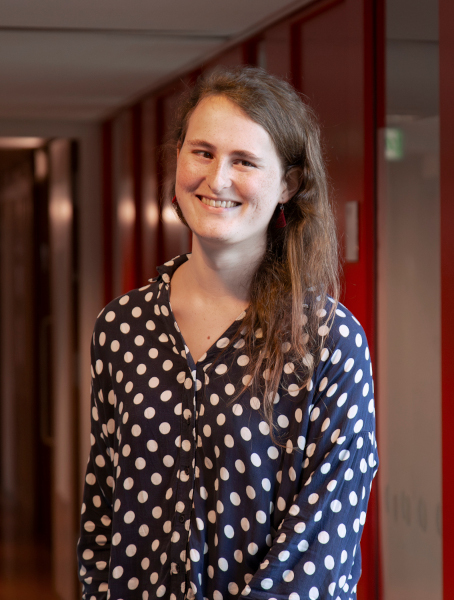

<figure class="float right">
    
</figure>

I am a third-year theoretical computer science PhD student supervised by Solon Pissis and Leen Stougie at CWI in Amsterdam.
My research is on algorithm design with a specific focus on string algorithms.
String algorithms, although a smaller sub-area of the broader theoretical computer science community, are ubiquitous in their applications to bioinformatics and information retrieval, among other fields.
My PhD is funded by CWI's Constance van Eeden PhD fellowship, which is intended to stimulate the representation of women in mathematics and computer science.

In my personal life I enjoy reading, playing piano, cooking, hiking, running and ice skating when the weather permits it.
I am a vegan and have an interest in promoting the rights and welfare of animals in general.
I strive to live in a society in which we no longer exploit nonhuman animals, the planet and one another.

You can read more about [my PhD research here](). See [here for a list of my publications]() and [here for my cv]().
